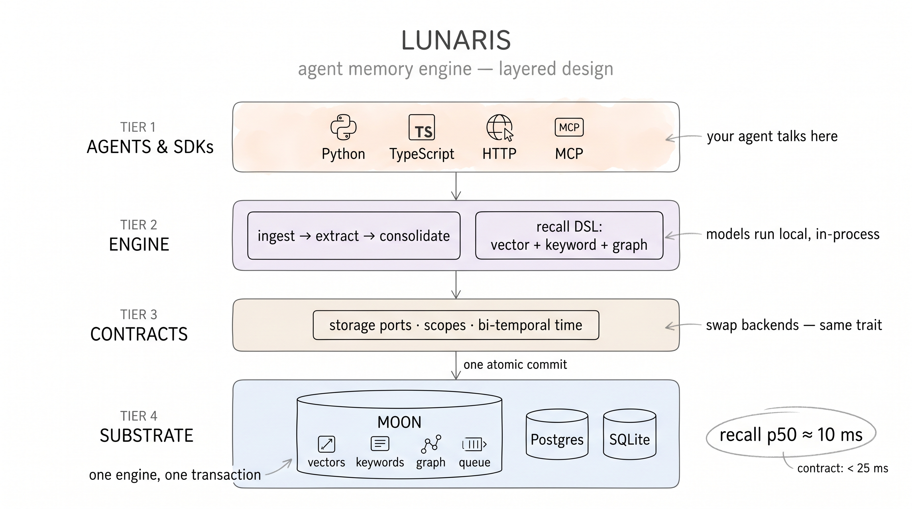
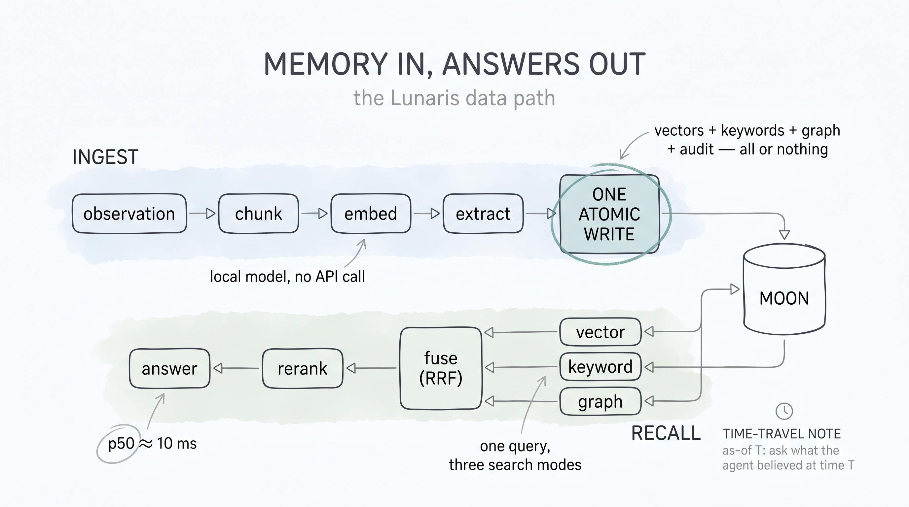
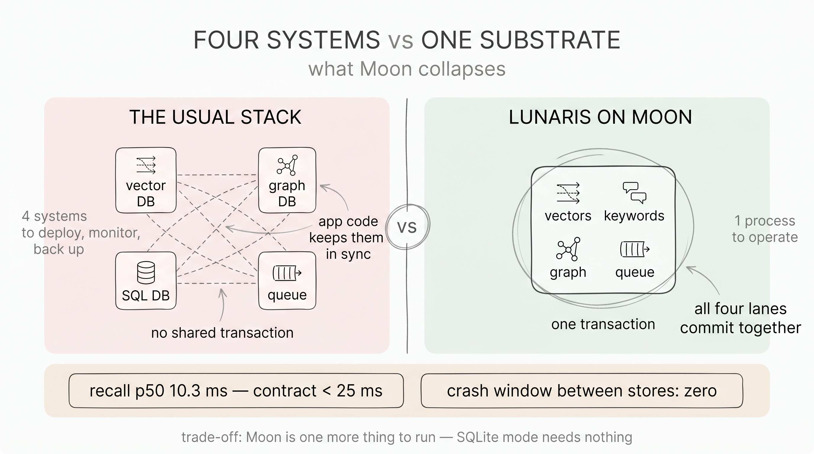
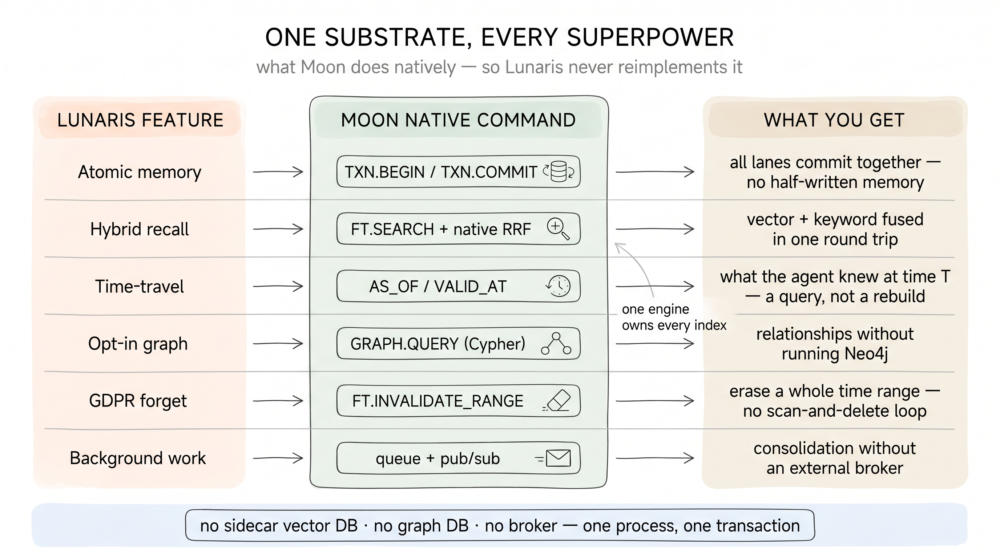
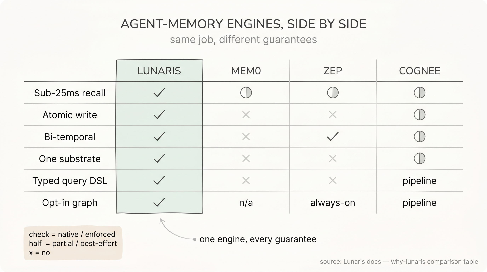

# Architecture at a Glance

Three pictures explain Lunaris. If you only have ninety seconds, read
the captions; the [full architecture page](https://github.com/pilotspace/lunaris/blob/main/docs/ARCHITECTURE.md)
carries the crate-level detail and the proof links.

## 1. The layers



Lunaris is a pure-Rust engine with thin SDK shells. Your agent talks to
the **surface** layer (Python, TypeScript, HTTP, or MCP). The **engine**
turns observations into structured memory and queries into fused result
sets. Everything below the engine is a **port** — a Rust trait — with one
implementation behind it:

- **Moon** — our Redis-compatible substrate, and since 0.7.0 the only
  backend. The Postgres portability proof and the SQLite onboarding
  backend were removed; the port stays a trait, so a third-party
  substrate is still an open extension point.

You never write Moon commands or SQL. You write one typed expression
(see [The Retrieval DSL](../guides/retrieval-dsl.md) for the full
operator set):

```rust,no_run
# async fn demo() -> Result<(), lunaris::LunarisError> {
use lunaris::{Keyword, Lunaris, Query, Scope, Vector};

let lunaris = Lunaris::open("moon://localhost:6380").await?;
let scoped  = lunaris.scoped(Scope::new("acme.agent-1")?);
# let last_tuesday = lunaris_core::Hlc::from_parts(1_736_467_200_000, 0, 0);

// Hybrid recall: vector + BM25 fused server-side, with a time-travel cut.
let hits = scoped
    .dsl()
    .with_root(Vector::new("chunks", 30).and(Keyword::bm25("chunks", 30)).fuse_rrf(60).top(5))
    .as_of(last_tuesday)
    .execute(Query::text("what did we decide about the pricing page?"))
    .await?;
# Ok(())
# }
```

## 2. The data path



Ingest flows left to right: observation → chunking → local embedding
(no API key, no network — models run in-process on CPU) → optional
entity/fact extraction → **one atomic commit**. That last box is the
heart of the system: vectors, keywords, graph edges, audit trail, and
the consolidation queue land in a *single transaction*. Either your
agent's memory is complete, or the write didn't happen. There is no
"the vector store has it but the graph doesn't" state — the failure
mode every fan-out memory stack eventually hits.

Recall flows right to left: your query fans out across semantic,
keyword, and graph lanes *inside the substrate*, gets fused by
reciprocal-rank fusion, optionally reranked by a cross-encoder, and
returns in **p50 19.2–22.4 ms · p95 22.3–24.1 ms · p99 23.4–24.4 ms**
against the target corpus of **100,000 documents per scope** — engine-side
(query embedding excluded), graph OFF, rerank OFF, k=30, single-shard Moon
v0.8.5 on an Apple M4 Pro, 500 timed queries after 50 warmup, run-to-run p50
drift ± 3 ms ([envelope + method](https://github.com/pilotspace/lunaris/blob/main/docs/operations/capacity.md), [raw samples](https://github.com/pilotspace/lunaris/blob/main/docs/benchmarks/ga2b-raw/README.md)). The published
contract is p50 < 25 ms, so the headroom is ≤ 25 %. Since the 2026-06-10
concurrent-hydration
fan-out the tail is flat even at k=30 — p50 6.0 ms / p99 6.2 ms
([A/B methodology](https://github.com/pilotspace/lunaris/blob/main/docs/benchmarks/v0.6-recall-fanout-ab.md)).
The contract was re-validated on Moon v0.3.0 with the 4-bit GGUF
granite embedder — retrieval-only p50 3.1 ms / p99 3.6 ms on a 3k-doc
SQuAD corpus
([v0.3.0 rerun](https://github.com/pilotspace/lunaris/blob/main/docs/benchmarks/v0.7-moon-v030-rerun.md),
which also sizes the Navigate operator's recall edge on graph-linked
corpora: plain 0.00 → nav 1.00 recall@5 for +0.05 ms).

## 3. Why Moon makes this possible



The conventional agent-memory stack is three databases and a broker:
a vector DB for similarity, a graph DB for relationships, a relational
DB for records, and a queue for background work. Four systems, four
failure domains, four consistency boundaries — and *no transaction that
spans them*.

Moon collapses the stack into one process. The payoff isn't abstract —
it shows up feature by feature. Each Lunaris capability you actually use
maps onto something Moon does *natively*, so the engine never
reimplements a vector index, a BM25 scorer, a graph engine, or a
transaction log on top of a dumb key-value store:



The same story as a lookup table — the command family behind each row:

| Capability | Moon command family | What Lunaris does with it |
|---|---|---|
| Transactions | `TXN.BEGIN` / `TXN.COMMIT` | The single atomic ingest commit |
| Vector KNN | `FT.SEARCH` | Semantic recall, auto-indexed on write |
| BM25 keywords | `FT.SEARCH` (same index) | Exact-term recall, no second system |
| Hybrid fusion | native RRF | Vector + keyword fused server-side |
| Time travel | `AS_OF` / `VALID_AT` clauses | "What did the agent believe at time T?" |
| Property graph | `GRAPH.QUERY` (Cypher) | Opt-in relationship traversal, per-tenant graphs |
| Bulk forget | `FT.INVALIDATE_RANGE` | GDPR-grade deletion over time ranges |
| Queues | native queue + pub/sub | Consolidation without a broker |

One substrate, one transaction boundary, one operational surface. That
is the design bet — and the measured sub-25 ms recall is what the bet
pays out.

### How that lands against other tools

Most agent-memory engines do the same job; what differs is the
*guarantees*. Because Lunaris pushes vectors, keywords, the graph, the
queue, and a transaction boundary into a single substrate, several rows
below are a ✓ for Lunaris where the fan-out tools can only manage a
partial or an ✗:



Every cell above is taken straight from the [full comparison table in
**Why Lunaris**](./why-lunaris.md), which carries the nuance each mark
compresses — plus the honest "use a different tool when…" criteria. The
short version: Lunaris trades a hosted-SaaS option and Python-native
simplicity for a latency contract and an atomicity guarantee the
fan-out tools structurally can't make.

**Honest footnote:** plain key-value point reads on Moon are not
natively temporal (the engine applies the temporal cut itself), and
index schemas are fixed at creation. The
[architecture page](https://github.com/pilotspace/lunaris/blob/main/docs/ARCHITECTURE.md#honest-limits-read-before-quoting-the-table-above)
lists every limit next to every advantage.

## Where next

- [10-Minute Quickstart](./quickstart.md) — first recall against a
  local Moon
- [Core Concepts](./concepts.md) — episodes, primitives, scopes,
  bi-temporal time
- [The Retrieval DSL](../guides/retrieval-dsl.md) — composing
  vector / keyword / graph queries
- [The Storage Backend](../operations/backends.md) — Moon setup and
  its honest limits
