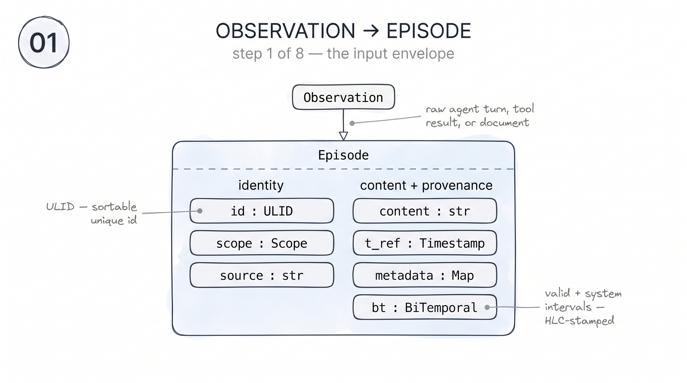
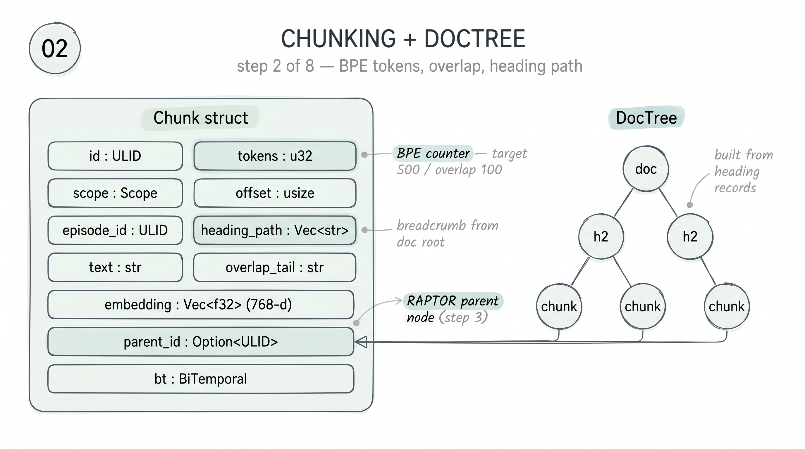
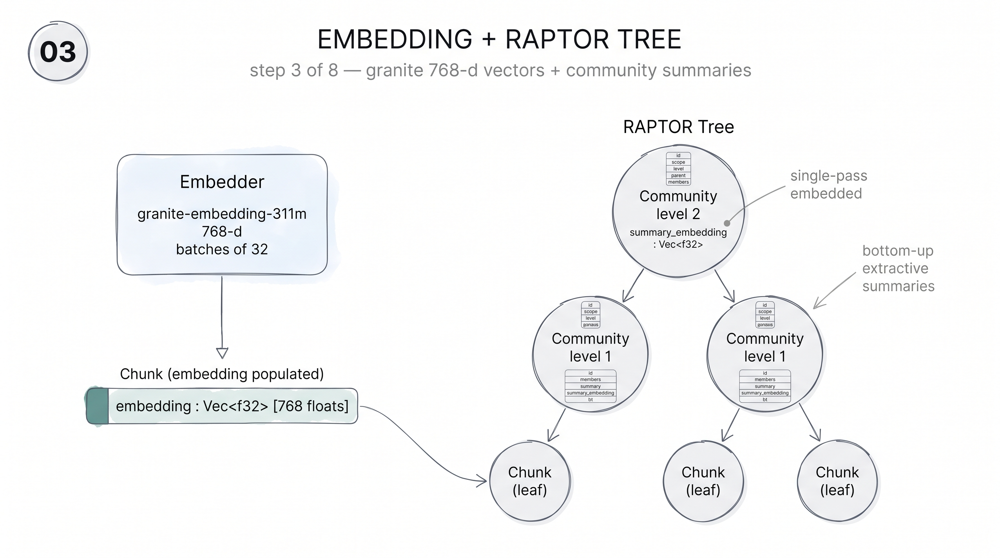
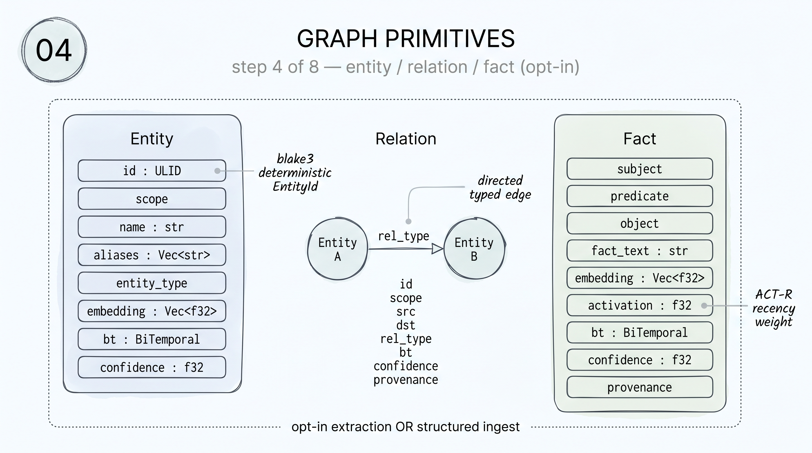
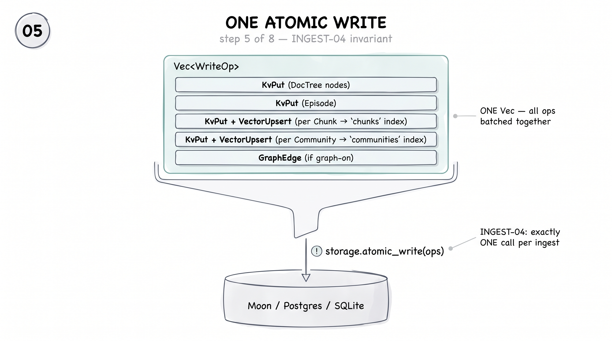
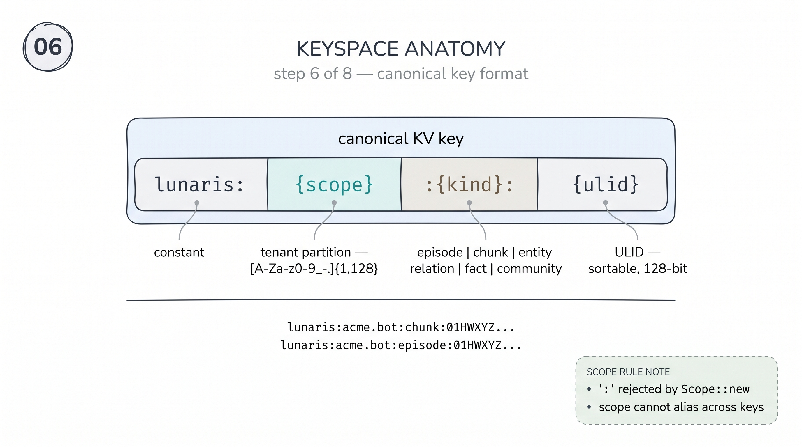
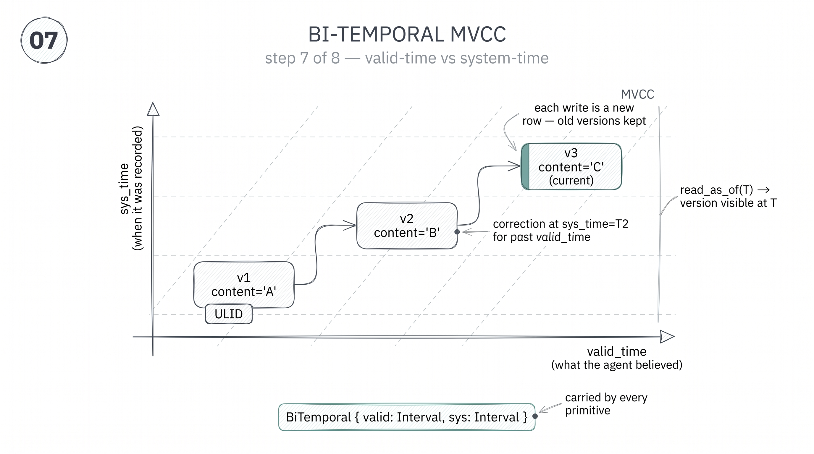
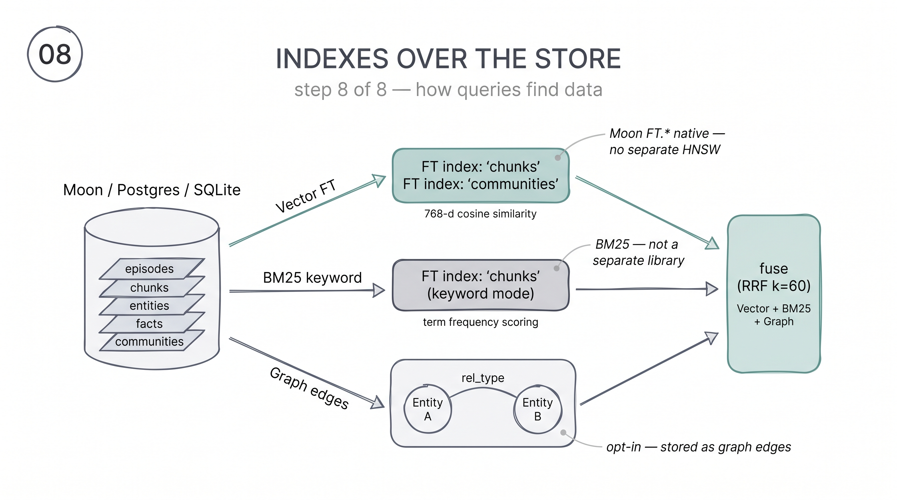

# Data Structures: A Visual Tour

Lunaris transforms raw observations into a rich set of structured primitives before storing them in a bi-temporal MVCC store. This page walks through each stage visually — from the Episode envelope that wraps every input, through chunking and embedding, all the way to the indexed storage layer that makes sub-25ms recall possible.

---

## Step 1 — Observation → Episode

Every agent turn, tool result, or document arrives as a raw Observation and is immediately wrapped in an Episode envelope. The Episode captures identity (id, scope, source), the content string, a reference timestamp (t_ref), free-form metadata, and a BiTemporal record (bt) that tracks both valid-time and system-time intervals.

---

## Step 2 — Chunking + DocTree

The episode content is split into overlapping Chunks using a BPE token counter (target 500 tokens, overlap 100). Each Chunk carries its heading breadcrumb (heading_path), the overlap bridge to the previous chunk (overlap_tail), and a parent_id that will point to its RAPTOR parent node. Heading records also build a DocTree capturing the document's structural outline.

---

## Step 3 — Embedding + RAPTOR Tree

Each Chunk receives a 768-dimensional embedding from the granite-embedding-311m model in batches of 32. The RAPTOR tree then connects Chunks upward: Community nodes at each level carry a bottom-up extractive summary and a summary_embedding, forming a hierarchy that lets recall query at any granularity.

---

## Step 4 — Graph Primitives

When graph extraction is enabled — or when structured ingest supplies pre-parsed data — Entities, Relations, and Facts are derived. Entity IDs are deterministic blake3 hashes so the same real-world entity always maps to the same id across ingests. Facts carry an activation field that the ACT-R consolidator uses for recency weighting.

---

## Step 5 — Atomic Persist

All write operations — DocTree KvPuts, Episode KvPut, per-Chunk KvPut + VectorUpsert into the "chunks" FT index, per-Community KvPut + VectorUpsert into the "communities" FT index, and optional GraphEdge writes — are collected into a single Vec&lt;WriteOp&gt; and submitted via one storage.atomic_write call. The INGEST-04 invariant guarantees exactly one atomic_write per ingest.

---

## Step 6 — Keyspace

Every primitive is stored under the canonical key format `lunaris:{scope}:{kind}:{ulid}`, where scope is a validated string (alphabet `[A-Za-z0-9_-.]{1,128}`, `:` explicitly rejected), kind is one of episode, chunk, entity, relation, fact, or community, and the ulid provides a sortable 128-bit unique identifier.

---

## Step 7 — Bi-temporal MVCC

Every primitive carries a BiTemporal record with two interval fields: valid (when the fact was true in the world) and sys (when it was recorded in Lunaris). Each write appends a new version row; old versions are never deleted.

`read_as_of(T)` returns the version visible at logical time T — **on a backend that keeps a KV version chain**. No 0.7.0 backend does. Moon's Lunaris rows are plain hashes, so a historical `read_as_of` returns an explicit `StorageError::NotSupported` (HTTP `501 not_supported`) instead of quietly handing back today's row, and the Postgres/SQLite backends that answered it (`supports_historical_kv_reads() == true`) were deleted in 0.7.0. Latest-state reads are unaffected, and the search and graph lanes stay temporal through `FT.SEARCH AS_OF` / `GRAPH.QUERY VALID_AT`.

---

## Step 8 — Indexes

Three indexes sit over the store. A vector FT index on "chunks" and a separate one on "communities" enable 768-d cosine similarity search. A BM25 keyword index enables term-frequency scoring. Graph edges capture Relations for graph traversal. Moon's native FT.* commands serve all three modes — Lunaris does not bundle a separate HNSW or BM25 library. At query time, results from all lanes are fused using RRF (k=60).
