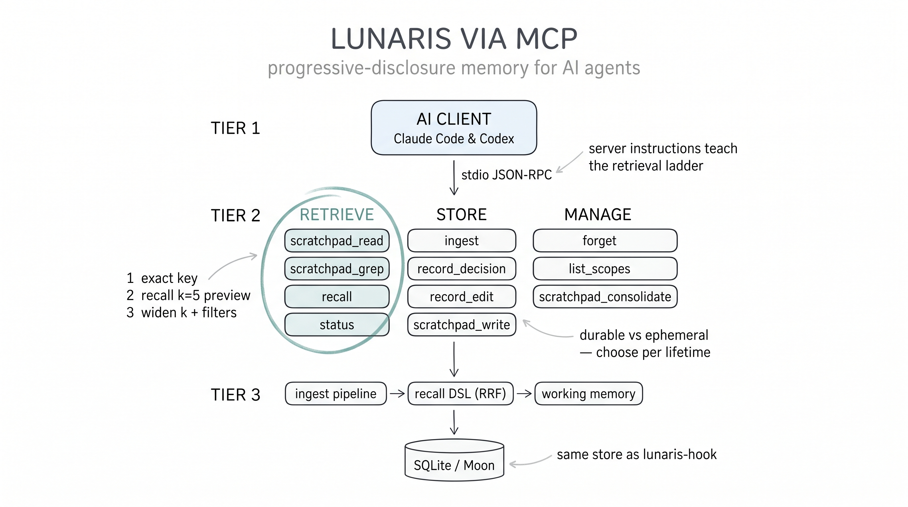
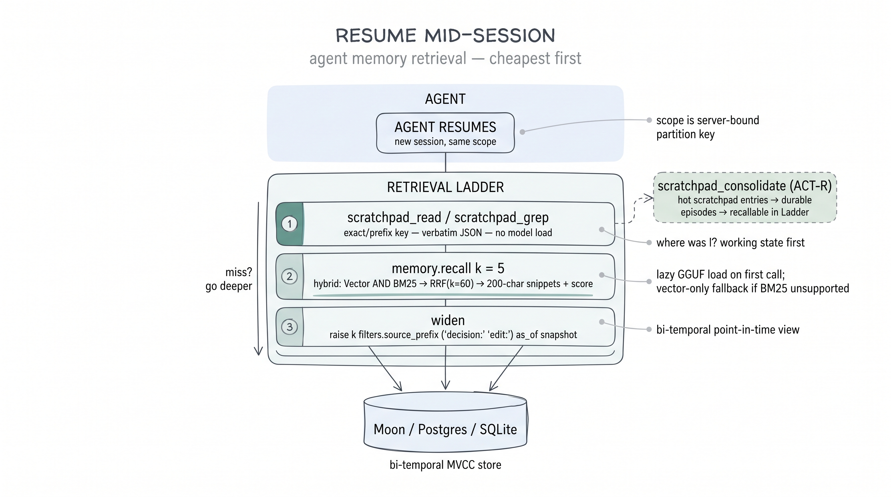

# MCP Server

`lunaris-mcp` exposes Lunaris memory to any [Model Context Protocol][mcp]
(MCP) agent — Claude Code, OpenAI Codex, and anything else that speaks MCP —
over the **stdio** transport. The agent gets persistent, scope-isolated
memory it can write to and recall from across sessions, with the same
bi-temporal storage and atomicity guarantees as the rest of Lunaris.

> **MCP ≠ MemoryProtocol 0.1.** This page is about the *agent-facing MCP
> server* (a stdio JSON-RPC tool surface). The
> [MemoryProtocol](../protocol/memoryprotocol-0.1.md) chapter is a separate
> HTTP/SSE wire protocol for the Lunaris HTTP server. They solve different
> problems and are not interchangeable.

[mcp]: https://modelcontextprotocol.io



## Install

No Rust toolchain is required for the `npx` / `uvx` paths — both download a
prebuilt binary for your platform on first run.

```sh
# Rust (builds from source → ~/.cargo/bin/lunaris-mcp).
# NOT `cargo install lunaris-mcp` — the crate is publish = false (it links
# lunaris-memory-service, which has a vendor/ path dep) so it is not on
# crates.io. Needs cmake + a C++ compiler for llama.cpp.
cargo install --git https://github.com/pilotspace/lunaris lunaris-mcp

# Node (no Rust toolchain)
npx -y @pilotspace/lunaris-mcp --help

# Python (no Rust toolchain)
uvx lunaris-mcp --help
```

Supported prebuilt platforms: `linux-x64`, `linux-arm64`, `darwin-x64`,
`darwin-arm64`, `win32-x64`. On any other platform, `cargo install
lunaris-mcp` builds from source.

> **Registry availability.** The `npx`/`uvx` packages
> (`@pilotspace/lunaris-mcp`, `lunaris-mcp`) are published as part of the
> npx/uvx distribution wave; until your registry shows them, `cargo install
> lunaris-mcp` is the always-available path. The npm/PyPI wrappers honour
> `LUNARIS_MCP_BIN_PATH` for air-gapped hosts.

## Tool surface

Eleven tools are registered (all implemented) — seven durable-memory tools
plus four working-memory (scratchpad) tools:

| Tool | Input | Returns |
|------|-------|---------|
| `memory.ingest` | `source`, `content`, optional `t_ref`, `metadata` | `{ lsn }` |
| `memory.recall` | `query`, optional `k`, `filters`, `as_of` | `{ hits[] }` |
| `memory.forget` | `target.source_prefix` **XOR** `target.episode_id`, optional `dry_run` (**defaults to `true`**) | `{ status, dry_run, matched, removed }` |
| `memory.list_scopes` | _(none)_ | `{ scopes[] }` |
| `memory.record_decision` | `decision`, `rationale`, optional `alternatives`, `tags`, `dedupe_key` | `{ lsn, was_duplicate }` |
| `memory.record_edit` | `path`, `after`, optional `before`, `intent`, `dedupe_key` | `{ lsn, was_duplicate }` |
| `memory.status` | _(none)_ | backend capability profile + MQ queue-depth probes |
| `memory.scratchpad_write` | `key`, `value`, optional `namespace` | `{ lsn }` |
| `memory.scratchpad_read` | `key`, optional `namespace` | `{ found, value }` |
| `memory.scratchpad_grep` | `pattern`, optional `namespace` | `{ entries[] }` |
| `memory.scratchpad_consolidate` | optional `namespace` | `{ status, promotions, archives }` |

`memory.ingest` is the general capture path. `memory.record_decision` and
`memory.record_edit` are structured aliases that write intent-typed episodes
(`source = "decision:<scope>"` / `"edit:<scope>"`) with optional `dedupe_key`
idempotency. `memory.status` reports the bound scope and backend capabilities
(`queue_native`, `graph_native`, `rerank_native`, `native_rrf`,
`max_vector_dim`, `cypher_dialect`, …).

The four `memory.scratchpad_*` tools are working memory — transient,
key-addressed notes (drafts, plans, in-progress state) under a `scratchpad/`
namespace, separate from the durable episode log. `scratchpad_write`/`read`
are key-value put/get, `scratchpad_grep` lists entries by key-prefix, and
`scratchpad_consolidate` drains the scratchpad queue and promotes/archives
notes by activation. `scratchpad_consolidate` needs a native-queue backend;
Moon has one, so on 0.7.0 it is always available. (It still returns
`{ status: "unsupported_backend" }` if the connected substrate reports no
queue — see [Storage](#storage).)

`memory.forget` **previews by default**: with `dry_run` omitted it scans,
returns `{ status: "preview", matched: N, removed: 0 }`, and writes nothing.
Deleting takes an explicit `"dry_run": false`. This inverts the HTTP
`POST /v1/forget` default (`dry_run: false` there, for API compatibility) on
purpose — the MCP caller is a language model, so the irreversible branch must
be the one it has to ask for.

The wire DTOs are identical across MCP clients, and every request DTO carries
`#[serde(deny_unknown_fields)]` — no wire field can override the bound scope.

## Progressive disclosure — the retrieval ladder



The server `instructions` (returned at MCP `initialize`) and every tool
description teach connecting agents to retrieve cheapest-first:

1. **`scratchpad_read` / `scratchpad_grep`** — exact or prefix key lookup;
   returns full verbatim values; no model load. Always first for known keys.
2. **`memory.recall` with the default `k = 5`** — hybrid semantic + BM25
   preview pass. Hits are **200-character snippets** (with `episode_id`,
   `source`, `score`), not full episode text, and the first call in a process
   stages/loads the GGUF embedder.
3. **Widen only on a miss** — raise `k`, add `filters.source_prefix`
   (`decision:`, `edit:`, `claude-code:`), or pass `as_of` for a bi-temporal
   point-in-time view.

There is intentionally **no fetch-full-episode tool**: widen `k` for more
context, or keep full-fidelity values in the scratchpad where reads are
verbatim. `memory.status` / `memory.list_scopes` are diagnostics, not
retrieval.

## Scope is bound at startup

`lunaris-mcp` resolves one scope when it starts and never changes it from wire
payloads. Resolution order:

1. `--scope` flag / `LUNARIS_MCP_SCOPE` env var (highest priority).
2. `git remote.origin.url` + current branch → blake3 → `"git_<hex16>"`.
3. Canonical cwd → blake3 → `"cwd_<hex16>"`.

The resolved scope is persisted to `~/.lunaris/scopes.json`. To rename it,
edit the `name` field there and restart the host agent (which restarts the
`lunaris-mcp` child). See [Multi-Agent & Scope](../guides/multi-agent.md) for
the scope model.

## Storage

**`LUNARIS_MCP_STORAGE` (or `--storage`) is required, and Moon is the only
backend.** Through 0.6.x an unset value opened a per-scope SQLite file at
`~/.lunaris/<scope>.db`; 0.7.0 deleted that backend, and the server now
**refuses to boot** rather than guess a store — a stdio server surfaces tool
errors to its client but not startup logs, so "starts, then fails every call"
was the worst outcome available. The refusal prints the quickstart.

```bash
docker run -d --name lunaris-moon -p 6380:6379 \
  ghcr.io/pilotspace/moon:0.8.5 \
  --shards 1 --protected-mode no --appendonly yes
```

```jsonc
"env": { "LUNARIS_MCP_STORAGE": "moon://127.0.0.1:6380" }
```

`--shards 1` is mandatory — an ingest is one MULTI/EXEC transaction and a
sharded Moon rejects it. All eleven tools work against Moon: native HNSW
vector search, BM25 keyword fusion, graph, queues, and search-side bi-temporal
reads. See
[Running an external Moon](https://github.com/pilotspace/lunaris/blob/main/docs/operations/external-moon.md).

> **Auto-launched Moon (opt-in build, development only).** A source build with
> `cargo build -p lunaris-mcp --features embedded-moon` makes `lunaris-mcp`
> launch an in-process Moon (rooted at `./.lunaris-moon`) when no
> `LUNARIS_MCP_STORAGE` override is set, then use it automatically. The feature
> is **off by default** and is **not** compiled into the published
> `npx`/`uvx`/`cargo install` binaries. An explicit
> `--storage`/`LUNARIS_MCP_STORAGE` still wins; a failed bring-up is now
> terminal (it used to fall back to SQLite — there is nothing to fall back to).

> The first `memory.recall` stages the GGUF embedder (~150 MB) and reranker
> to `~/.lunaris/models/` — expect ~30 s on a cold start, fast thereafter.
> Set `LUNARIS_MCP_SKIP_STAGE=1` if models are pre-staged.

## Key environment variables

| Variable | Default | Description |
|----------|---------|-------------|
| `LUNARIS_MCP_SCOPE` | derived from git/cwd | Force a specific scope name |
| `LUNARIS_MCP_STORAGE` | *(required — no default)* | Storage URL. `moon://host:port` only; the server refuses to boot without it |
| `LUNARIS_GRAPH_ENABLED` | off | Enable the graph extraction/write path (Moon graph recall) |
| `LUNARIS_MCP_LOG` | `info,rmcp=warn` | `tracing`-style filter directive (logs to **stderr only**) |
| `LUNARIS_MCP_SKIP_STAGE` | unset | Set to `1` to skip GGUF staging on first recall |
| `LUNARIS_MCP_BIN_PATH` | unset | (`npx`/`uvx` wrappers) point at a pre-staged binary for air-gapped hosts |

> **stdout is the JSON-RPC transport.** `lunaris-mcp` writes logs to stderr
> only. Anything printed to stdout (e.g. an `echo` in your shell profile)
> corrupts the MCP framing and silently disconnects the host agent.

## Per-agent guides

- [Claude Code](./claude-code.md) — `claude mcp add`, project-scoped
  `.mcp.json`, and the optional lifecycle hooks + context injection.
- [Codex CLI](./codex.md) — `~/.codex/config.toml`, plus hooks and the
  `lunaris-contextd` warm sidecar.

The exhaustive guides — full hook tables, `lunaris-contextd` internals, and
measured timings — live in the repo:
[`docs/integration/claude-code.md`](https://github.com/pilotspace/lunaris/blob/main/docs/integration/claude-code.md)
and
[`docs/integration/codex.md`](https://github.com/pilotspace/lunaris/blob/main/docs/integration/codex.md).

## Status

The **stdio** transport is the supported path (Wave A). SSE transport with
Bearer auth and multi-user server mode are deferred to a later OIDC
milestone; running MCP as a feature flag on `lunaris-server` was evaluated and
rejected — see the
[decision record](https://github.com/pilotspace/lunaris/blob/main/docs/decisions/2026-05-24-claude-code-mcp-reversal.md).
