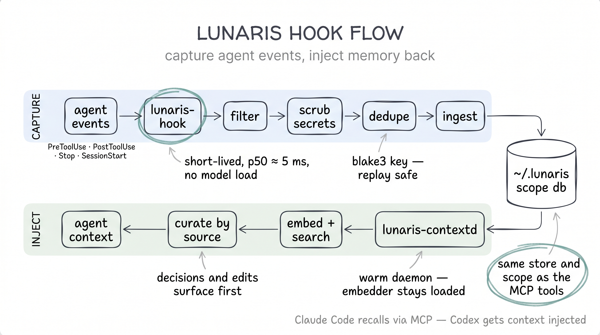

# Hooks Integration

`lunaris-hook` is a lightweight binary that captures agent lifecycle events into
Lunaris memory. Claude Code can call it directly. Codex uses
`scripts/lunaris-codex-hook-adapter.py` to normalize Codex hook envelopes into
the same capture path.

For Codex, Lunaris also provides `lunaris-contextd`, a warm local sidecar used
for proactive memory injection before prompts and after useful tool calls. The
sidecar keeps model resources loaded once, so hook subprocesses do not reload
or rehash GGUF files on every recall.



---

## Installation

```bash
# From crates.io (once published):
cargo install lunaris-hook

# From source:
cargo install --path crates/lunaris-hook

# Or from the workspace, when developing locally:
cargo build --release -p lunaris-hook
```

> **Future:** `npx lunaris-hook` packaging is planned for Phase 26 (no Rust
> toolchain required on developer machines).

---

## Claude Code configuration

Add `lunaris-hook` to `~/.claude/settings.json`:

```json
{
  "hooks": {
    "PreToolUse": [
      { "matcher": "", "hooks": [{ "type": "command", "command": "lunaris-hook" }] }
    ],
    "PostToolUse": [
      { "matcher": "", "hooks": [{ "type": "command", "command": "lunaris-hook" }] }
    ],
    "Stop": [
      { "matcher": "", "hooks": [{ "type": "command", "command": "lunaris-hook" }] }
    ],
    "SessionStart": [
      { "matcher": "", "hooks": [{ "type": "command", "command": "lunaris-hook" }] }
    ]
  }
}
```

Claude Code pipes a JSON envelope to `lunaris-hook` stdin on each lifecycle
event. The hook writes one Episode to `~/.lunaris/<scope>.db` — the same file
used by `lunaris-mcp` — so `memory.recall` queries surface both hook-captured
and MCP-captured episodes.

---

## Codex configuration

Codex has two hook layers:

1. async capture, which should never block the model flow;
2. synchronous context injection, which returns a Codex `context` fragment.

Use the setup script for normal installation:

```sh
scripts/setup-lunaris-agents.py --agent codex --runner local
```

The setup script defaults hook/context storage to Moon by writing
`LUNARIS_STORE_URL=moon://127.0.0.1:6380`. It also writes
`LUNARIS_GRAPH_ENABLED=1` for Moon-backed installs, which lets graph-enabled
ingests populate Moon's graph store for later graph retrieval. Use
`--moon-url moon://host:port` to point at another Moon instance, or
`--storage-backend sqlite` to opt back into per-scope SQLite.

Packaged MCP runner modes are also supported once the PyPI/npm packages are
published:

```sh
scripts/setup-lunaris-agents.py --agent codex --runner uvx
scripts/setup-lunaris-agents.py --agent codex --runner npx
```

Or build the hook binaries and configure Codex manually:

```sh
cargo build --release -p lunaris-hook
```

```toml
[hooks]
user_prompt_submit = [
  { matcher = "", hooks = [
    { type = "command", command = "/path/to/lunaris/scripts/lunaris-codex-hook-adapter.py --mode capture", timeout = 2, async = true, statusMessage = "Lunaris memory capture" },
    { type = "command", command = "/path/to/lunaris/scripts/lunaris-codex-hook-adapter.py --mode inject", timeout = 2, async = false, statusMessage = "Lunaris memory recall" },
  ] },
]

post_tool_use = [
  { matcher = "", hooks = [
    { type = "command", command = "/path/to/lunaris/scripts/lunaris-codex-hook-adapter.py --mode capture", timeout = 2, async = true, statusMessage = "Lunaris memory capture" },
    { type = "command", command = "/path/to/lunaris/scripts/lunaris-codex-hook-adapter.py --mode post-tool", timeout = 2, async = false, statusMessage = "Lunaris post-tool memory recall" },
  ] },
]

stop = [
  { matcher = "", hooks = [
    { type = "command", command = "/path/to/lunaris/scripts/lunaris-codex-hook-adapter.py --mode capture", timeout = 2, async = true, statusMessage = "Lunaris memory capture" },
    { type = "command", command = "/path/to/lunaris/scripts/lunaris-codex-hook-adapter.py --mode feedback", timeout = 2, async = true, statusMessage = "Lunaris memory feedback" },
  ] },
]
```

Use `--mode capture` for `session_start`, `pre_tool_use`, `pre_compact`,
`post_compact`, `subagent_start`, and `subagent_stop`.

Full Codex setup is documented in [`docs/integration/codex.md`](codex.md).

### Codex hook modes

| Mode | Intended events | Behavior |
|------|-----------------|----------|
| `capture` | all lifecycle events | normalize Codex JSON and forward to `lunaris-hook` |
| `inject` | `user_prompt_submit` | recall relevant memories and emit a Codex `context` entry |
| `post-tool` | `post_tool_use` | capture compact tool result, recall related memories, emit smaller `context` |
| `feedback` | `stop` | record turn feedback and injected memory ids when available |
| `auto` | manual testing | capture plus injection based on event kind |

The context output shape is:

```json
[{"kind":"context","text":"<lunaris_memory_context phase=\"prompt\">...</lunaris_memory_context>"}]
```

Do not print diagnostics to stdout from hook commands. Stdout is reserved for
Codex hook output.

---

## Codex context injection flow

```text
user_prompt_submit
  |
  | async
  v
lunaris-hook capture --------------------------+
                                               |
  | sync                                       v
  v                                    ~/.lunaris/<scope>.db
lunaris-contextd recall
  |
  v
Codex receives HookOutputEntry(kind="context")
```

After tool calls:

```text
post_tool_use
  |
  | async capture
  v
lunaris-hook

post_tool_use
  |
  | sync sidecar request
  v
lunaris-contextd
  |-- capture compact tool result
  |-- recall related memories
  `-- return smaller context block
```

Injected blocks are intentionally small:

```text
<lunaris_memory_context phase="prompt">
Retrieved memories for this prompt. Use only when relevant.

- [source=decision:repo score=0.84 id=01...] Relevant prior decision...
</lunaris_memory_context>
```

```text
<lunaris_memory_context phase="post_tool" tool="Read">
Tool result may relate to these memories.

- [source=edit:repo score=0.71 id=01...] Prior edit in this file...
</lunaris_memory_context>
```

`lunaris:memory_injection` episodes are written as traces but excluded from
future injection recall to avoid self-reinforcing context loops.

---

## Scope derivation

`lunaris-hook` derives the active scope the same way `lunaris-mcp` does:

1. `LUNARIS_HOOK_SCOPE` env var override (highest priority).
2. `git remote.origin.url + branch` → blake3 → `"git_<hex16>"`.
3. Canonical cwd → blake3 → `"cwd_<hex16>"`.

Scopes are persisted at `~/.lunaris/scopes.json`. Episodes written by
`lunaris-hook` land in the same scope as your MCP session, so `memory.recall`
queries surface both.

---

## Captured event kinds

| Event | Episode source | Captured content |
|-------|---------------|-----------------|
| `PreToolUse` | `lunaris:pre_tool_use` | `tool_input` JSON |
| `PostToolUse` | `lunaris:post_tool_use` | `tool_response` JSON |
| `Stop` | `lunaris:stop` | *(no content — boundary marker)* |
| `SessionStart` | `lunaris:session_start` | *(no content — boundary marker)* |
| *(any other)* | *(no Episode written)* | exits 0 (forward-compat no-op) |

Unknown event kinds exit 0 intentionally. This ensures forward compatibility
when Anthropic adds new hook event types to Claude Code.

Codex events are normalized by the adapter into the same four compatibility
envelopes. The original Codex payload is stored under `codex_payload` inside
the normalized tool input or response.

---

## Filter policy (HOOK-03)

Events are filtered in three stages, applied in order:

### Stage 1: Path glob deny-list

Files matching any deny pattern are rejected before scrubbing. Built-in
deny patterns (always active, cannot be overridden):

| Pattern | Rationale |
|---------|-----------|
| `**/.env` | Environment variable files |
| `**/*.pem` | TLS certificates |
| `**/id_rsa*` | SSH private keys |
| `**/*.key` | Generic private key files |
| `**/.git/**` | Git internals |
| `**/node_modules/**` | Dependency trees (noise) |
| `**/target/**` | Rust build artifacts (noise) |

Additional excludes: set `LUNARIS_HOOK_EXCLUDE=pattern1:pattern2` (colon-separated glob patterns).
Additional includes (re-include from built-in excludes): set `LUNARIS_HOOK_INCLUDE=pattern1:pattern2`.
Note: `LUNARIS_HOOK_INCLUDE` cannot override built-in deny patterns — security posture is additive only.

### Stage 2: Event kind filter

For tool events, these tool names are captured by default:

```text
Read, Edit, MultiEdit, Write, Bash
```

To restrict event kinds:

```bash
# Only capture PreToolUse and PostToolUse:
export LUNARIS_HOOK_KINDS="PreToolUse,PostToolUse"
```

### Stage 3: Content truncation

Tool payloads larger than 128 KiB are truncated to preserve the head
(first 64 KiB) and tail (last 32 KiB) of the content with an elision marker:

```
<head:65536 bytes>
[... elided 12345 bytes ...]
<tail:32768 bytes>
```

The `truncated_bytes` count is recorded in the Episode metadata. Truncation
runs before scrubbing so secrets in the elided middle are never stored.

---

## Secret scrubber (HOOK-04)

All eleven built-in scrubber patterns run on every captured event's content.
They cannot be disabled — the scrubber set is closed and auditable.

| Kind | Pattern | Replacement |
|------|---------|-------------|
| `ENV_KEY` | Lines matching `^[A-Z_]+=.*` in `.env`-style content | `<REDACTED:ENV_KEY>` |
| `AWS_KEY` | `AKIA[0-9A-Z]{16}` | `<REDACTED:AWS_KEY>` |
| `GH_TOKEN` | `gh[pousx]_[A-Za-z0-9_]{36}` | `<REDACTED:GH_TOKEN>` |
| `SSH_KEY` | `-----BEGIN .* PRIVATE KEY-----` blocks | `<REDACTED:SSH_KEY>` |
| `JWT` | `eyJ[A-Za-z0-9_-]+\.[A-Za-z0-9_-]+\.[A-Za-z0-9_-]+` | `<REDACTED:JWT>` |
| `API_KEY` | `sk-(?:ant-)?[A-Za-z0-9_\-]{16,}` (Anthropic, OpenAI, …) | `<REDACTED:API_KEY>` |
| `SLACK_TOKEN` | `xox[baprs]-[A-Za-z0-9\-]{10,}` | `<REDACTED:SLACK_TOKEN>` |
| `GITLAB_PAT` | `glpat-[A-Za-z0-9_\-]{20}` | `<REDACTED:GITLAB_PAT>` |
| `GCP_KEY` | `AIza[0-9A-Za-z_\-]{35}` | `<REDACTED:GCP_KEY>` |
| `KV_SECRET` | case-insensitive `password`/`passwd`/`pwd`/`secret`/`token`/`api_key` followed by `=` or `:` and a ≥4-char value (shell, JSON, or YAML form) | `<REDACTED:KV_SECRET>` |
| `BEARER` | `(?i)bearer <token ≥16 chars>` | `<REDACTED:BEARER>` |

> **False-positive risk:** The ENV_KEY and KV_SECRET patterns are broad by
> design — a benign `token: <value>` config line redacts (word-anchored, so
> `max_tokens: 4096` survives). Over-redaction costs readability, never a
> leak; that is the HOOK-04 posture. Review scrubber output if you capture
> config-heavy tool results.

---

## Custom policy file (HOOK-04)

Create `~/.lunaris/hook-policy.toml` to extend the built-in policy. Extensions
are **additive only** — built-in deny patterns and scrubbers always run.

```toml
# ~/.lunaris/hook-policy.toml
# Schema: v0 (Lunaris 0.5)

[scrubbers.custom]
# Add patterns to redact beyond the eleven built-ins.
patterns = [
  { name = "internal_secret", pattern = "INT_SECRET_[A-Z0-9]{32}", redact_as = "<REDACTED:INTERNAL>" },
]

[filters.paths]
# Extend the built-in deny list with additional glob patterns.
extra_excludes = ["**/secrets/**", "**/*.priv", "**/credentials.json"]
# Explicit re-includes: override extra_excludes (NOT built-in denies).
extra_includes = []
```

**Semantics:**
- If `~/.lunaris/hook-policy.toml` is absent → only built-ins apply. No error.
- If the TOML file is present but has a parse error → warn to stderr, fall back
  to built-ins only, exit 0. Never silently fail.
- Custom scrubber patterns are compiled once at process start and cached. The
  compilation cost is paid once per `lunaris-hook` invocation (each Claude Code
  event is a separate process).

---

## Dedupe key derivation (HOOK-05)

`lunaris-hook` computes a `blake3` dedupe key for every episode before writing:

```
dedupe_key = blake3_hex64(
    scope_bytes || 0x1F || event_id_bytes || 0x1F || canonical_json_bytes
)
```

Where:
- `scope` = the resolved scope string (e.g. `"git_a1b2c3d4e5f60001"`).
- `event_id` = the envelope's `event_id` field, or a synthetic id derived as
  `blake3_hex16(session_id || hook_event_name || transcript_path || timestamp)`
  if the field is absent.
- `canonical_json` = the **post-scrub** envelope serialized with sorted keys
  and no whitespace (deterministic byte sequence).

**Why post-scrub?** Two replays of the same event that both redact an AWS key
to `<REDACTED:AWS_KEY>` produce the same canonical JSON, and thus the same
dedupe key. Replay-safe deduplication holds even when the original secret text
differs between calls.

The dedupe key is stored in the `lunaris_dedupe` table. A second call with the
same key returns `IngestKind::Duplicate(prior_lsn)` — no second Episode is
written. The `was_duplicate` field in the MCP `memory.ingest` response reflects
this.

---

## Latency budget and emergency-drop (HOOK-06)

### Budget

The full hook pipeline (filter + scrub + dedupe + SQLite ingest) must complete
in:

| Metric | Budget |
|--------|--------|
| p50 | ≤ 50ms |
| p99 | ≤ 150ms |

These budgets are enforced by `crates/lunaris-hook/tests/cold_start.rs` over
1000 deterministic envelopes. **No GGUF model weights are loaded** at capture
time. For Codex/Claude Code sidecar capture, Moon-backed installs publish
captured chunk IDs to `__lunaris_embed__` and a background contextd worker
batches semantic vector promotion outside the hook response path.

Measured on M-series macOS (debug build, 2026-05-25):
- p50 = 4.7ms, p99 = 5.3ms — well within budget.

### Emergency-drop

To guarantee the hook never blocks a Claude Code tool invocation indefinitely
under storage-stall conditions, the ingest call is wrapped in:

```
tokio::time::timeout(LUNARIS_HOOK_DROP_AFTER_MS)
```

Default timeout: **100ms**. Override via:

```bash
export LUNARIS_HOOK_DROP_AFTER_MS=200   # relax for slow network storage
export LUNARIS_HOOK_DROP_AFTER_MS=50    # tighten for low-latency environments
```

Valid range: 10–10000ms. Values outside this range are clamped.

**On timeout:** The hook emits a single-line JSON warning to stderr and exits 0:

```json
{"level":"warn","event":"emergency_drop","reason":"ingest_timeout_100ms","scope":"git_a1b2...","kind":"PreToolUse"}
```

> **Security note (T-24-04-01):** The `emergency_drop` line contains the scope
> name and event kind. Operators who route `lunaris-hook` stderr to external
> log aggregators (Datadog, CloudWatch, etc.) **MUST sanitize** this output
> before forwarding — the scope name may reveal project identity.

---

## Exit codes

| Code | Meaning |
|------|---------|
| 0 | Success (Episode written), OR unknown event kind (forward-compat no-op), OR filter-rejected (event denied by policy), OR emergency-drop (ingest stalled beyond timeout) |
| 64 | Parse error — invalid JSON or missing `hook_event_name` field |
| 65 | Ingest error — storage rejected the write within the timeout window |
| 73 | Internal error — scope derivation failure or storage URL error |

Exit 0 covers both success and "safe failure" cases (filter, emergency-drop).
Claude Code interprets any non-zero exit as a hook failure and may suppress
future invocations for the session.

---

## Environment variables

| Variable | Default | Purpose |
|----------|---------|---------|
| `LUNARIS_HOOK_SCOPE` | *(derived)* | Override scope name directly |
| `LUNARIS_STORE_URL` | setup writes `moon://127.0.0.1:6380`; binary fallback is per-scope SQLite | Storage URL (shared with `lunaris-mcp`) |
| `LUNARIS_GRAPH_ENABLED` | setup writes `1` for Moon; binary fallback is off | Enable graph extraction/write path for graph retrieval |
| `LUNARIS_HOOK_LOG` | `warn` | Log filter directive (RUST_LOG syntax) |
| `LUNARIS_HOOK_LOG_JSON` | *(unset)* | Set to `1` for structured JSON stderr on errors |
| `LUNARIS_SCOPES_FILE` | `~/.lunaris/scopes.json` | Scopes registry path |
| `LUNARIS_HOOK_DROP_AFTER_MS` | `100` | Emergency-drop timeout in ms (clamped 10–10000) |
| `LUNARIS_HOOK_EXCLUDE` | *(unset)* | Colon-separated extra path glob excludes |
| `LUNARIS_HOOK_INCLUDE` | *(unset)* | Colon-separated extra path glob re-includes |
| `LUNARIS_HOOK_KINDS` | *(all)* | Comma-separated event kinds to capture |
| `LUNARIS_EMBEDDER_DIR` | *(system cache)* | Override model weights directory |
| `LUNARIS_RERANKER_DIR` | *(system cache)* | Override reranker weights directory |
| `LUNARIS_CONTEXTD_SOCKET` | `~/.lunaris/codex-contextd.sock` | Unix socket for Codex context sidecar |
| `LUNARIS_CONTEXTD_AUTOSTART` | `1` | Adapter autostarts sidecar when socket is absent |
| `LUNARIS_CONTEXT_CAPTURE_FAST` | `1` | Route Codex pre/post tool capture through warm `lunaris-contextd` instead of spawning `lunaris-hook` |
| `LUNARIS_CONTEXT_CAPTURE_TIMEOUT_MS` | `120` | Best-effort sidecar capture wait budget |
| `LUNARIS_CONTEXT_ENABLED` | `1` | Set to `0` to disable context injection |
| `LUNARIS_CONTEXT_TIMEOUT_MS` | `300` | Prompt injection wait budget |
| `LUNARIS_CONTEXT_POST_TOOL_TIMEOUT_MS` | `300` | Post-tool injection wait budget |
| `LUNARIS_CONTEXT_MAX_HITS` | `5` prompt, `3` post-tool | Shared injection hit cap |
| `LUNARIS_CONTEXT_MAX_CHARS` | `1600` prompt, `900` post-tool | Shared injection char cap |
| `LUNARIS_CONTEXT_MIN_SCORE` | `0.55` prompt, `0.60` post-tool | Shared injection score threshold |
| `LUNARIS_CONTEXT_POST_TOOL_MAX_HITS` | `3` | Optional post-tool hit cap override |
| `LUNARIS_CONTEXT_POST_TOOL_MAX_CHARS` | `900` | Optional post-tool char cap override |
| `LUNARIS_CONTEXT_POST_TOOL_MIN_SCORE` | `0.60` | Optional post-tool score threshold override |
| `LUNARIS_CONTEXT_EMBED_CACHE_MAX` | `256` | Maximum cached query embeddings kept by `lunaris-contextd` |
| `LUNARIS_EMBED_PROMOTION_ENABLED` | `1` | Publish sidecar capture chunks to Moon MQ for async semantic vector promotion |
| `LUNARIS_EMBED_PROMOTION_WORKER` | `1` | Run one contextd embed-promotion worker per active scope |
| `LUNARIS_EMBED_BATCH_SIZE` | `16` | Max chunks embedded per promotion batch |
| `LUNARIS_EMBED_BATCH_WAIT_MS` | `25` | Queue coalescing wait before a partial promotion batch runs |

The older `LUNARIS_CODEX_CONTEXT_*` and `LUNARIS_CODEX_POST_TOOL_*` names are
still accepted as compatibility aliases, but new Codex and Claude Code
installations should use the shared `LUNARIS_CONTEXT_*` names.

---

## Troubleshooting / FAQ

### The hook is writing episodes I don't expect

Check the filter policy: run with `LUNARIS_HOOK_LOG=debug` to see per-event
filter decisions logged to stderr.

```bash
LUNARIS_HOOK_LOG=debug lunaris-hook < /path/to/envelope.json
```

### I see `emergency_drop` in stderr

Storage is stalling beyond the configured timeout. Diagnose:

```bash
# Count recent drops in a log file
grep '"emergency_drop"' ~/.lunaris/hook-stderr.log | wc -l

# Check which scopes/kinds are dropping
grep '"emergency_drop"' ~/.lunaris/hook-stderr.log | jq -r '.scope + " " + .kind' | sort | uniq -c
```

If drops are frequent, check whether `~/.lunaris/<scope>.db` is on a slow
or remote filesystem. Consider increasing `LUNARIS_HOOK_DROP_AFTER_MS` or
moving the storage file to a local SSD.

### Dedupe: how do I know if an episode was a duplicate?

The `memory.ingest` MCP tool response includes `"was_duplicate": true` when
the hook's dedupe key matched a prior ingest. You can also check the
`lunaris_dedupe` table directly:

```sql
SELECT COUNT(*) FROM lunaris_dedupe WHERE scope = 'your-scope';
```

### The latency gate fails on CI

The `cold_start` test gate is designed for developer-machine hardware. On slow
CI runners the gate may breach the p99 budget. If this happens consistently:

1. Mark the test `#[ignore]` with a comment pointing to the evidence file.
2. Run the gate manually on a conforming developer machine.
3. Record the results in `milestones/v0.5-HOOK-LATENCY.json` as evidence.

The gate is not expected to fail on any modern macOS or Linux x86-64 host — if
it does, investigate whether a regex or SQLite write is taking an unexpected path
(e.g., accidental GGUF load via a transitive dependency).

### Can I capture read/edit tool calls?

Yes. `Read`, `Edit`, `MultiEdit`, `Write`, and `Bash` tool calls pass the
default tool-name filter. They are still subject to the path deny list and
secret scrubber.

For Codex, keep `LUNARIS_CONTEXT_CAPTURE_FAST=1` unless you are debugging the
legacy capture path. Fast capture sends pre/post tool events to
`lunaris-contextd`, which enqueues the memory write and returns before the
heavier semantic promotion work completes. On a warm local sidecar this keeps
capture latency in the low-millisecond range instead of paying a full hook
process plus model/storage path on every tool call.

### Codex memory injection returns no context

Check these in order:

```sh
codex doctor
test -x /path/to/lunaris/target/release/lunaris-contextd
test -S "$HOME/.lunaris/codex-contextd.sock" || echo "sidecar will autostart"
```

Then run a synthetic context hook:

```sh
printf '%s' '{"hook_event_name":"user_prompt_submit","session_id":"smoke","cwd":"'"$PWD"'","prompt":"recall prior Lunaris decision"}' \
  | /path/to/lunaris/scripts/lunaris-codex-hook-adapter.py --mode inject
```

No output is valid when there are no hits above the score threshold. Lower
`LUNARIS_CONTEXT_MIN_SCORE` temporarily to confirm the pipeline.

### Codex feels delayed after each prompt or tool call

The synchronous injection hooks wait for `lunaris-contextd` up to the configured
timeout. Hot cached recalls should be below 100 ms on a healthy local Moon
store, but the first recall for a new query still computes a local embedding.
Lower the budgets if responsiveness matters more than memory injection:

```sh
export LUNARIS_CONTEXT_TIMEOUT_MS=150
export LUNARIS_CONTEXT_POST_TOOL_TIMEOUT_MS=150
```

Set `LUNARIS_CONTEXT_ENABLED=0` to disable injection while keeping MCP
tools and async capture available.

---

## Security considerations

- **Scrubber is additive, not configurable off.** The eleven built-in patterns
  always run. This is intentional: a typo in `hook-policy.toml` can never
  silently disable AWS-key or JWT redaction.
- **Built-in path deny list is not overridable.** `**/.env`, `**/id_rsa*`,
  `**/*.pem`, and `**/.git/**` are always denied. Extra excludes via
  `LUNARIS_HOOK_EXCLUDE` extend, never replace, the built-in list.
- **Emergency-drop stderr contains scope + kind.** Do not route hook stderr
  to multi-tenant log aggregators without sanitization (T-24-04-01).
- **Storage URL is set by the operator.** `LUNARIS_STORE_URL` controls where
  episodes land. In multi-user environments, ensure each user has a distinct
  scope and storage path.
